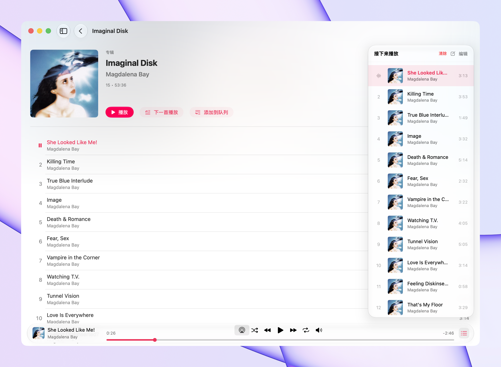

<p align="center">
  
</p>

<h1 align="center">Yorune</h1>

<p align="center">
  A native macOS music client built for Navidrome<br>
  Album browsing, streaming playback, queue management, AirPlay, and a desktop-first experience
</p>

<p align="center">
  <a href="#connect-to-navidrome">Connect to Navidrome</a> ·
  <a href="#build-from-source">Build from source</a>
</p>

<p align="center">
  <a href="README.en.md">English</a>
  <a href="README.md">简体中文</a>
</p>

<p align="center">
  
  
  
</p>

---

<p align="center">
  
</p>

## About

Yorune is a native macOS client for self-hosted Navidrome libraries. It reads albums, tracks, and artwork through the Subsonic API, then builds a complete desktop playback experience with SwiftUI, AppKit, and AVFoundation.

The library is organized around albums. Search or browse the collection, open an album to inspect its tracks, and start playback directly from the detail view. A bottom player handles progress, volume, and playback modes, while a side panel exposes the active queue.

## Why Yorune

Navidrome is an excellent self-hosted music server, but a browser player never feels completely at home on macOS. Yorune turns the remote library into a native desktop app with Mac-style windows, keyboard interaction, system audio routing, and settings.

- **Native interface**: SwiftUI navigation, album grids, and a macOS 26 Liquid Glass player bar
- **Complete controls**: play, pause, previous, next, seeking, and volume
- **Playback modes**: shuffle, repeat all, and repeat one
- **Queue management**: inspect, jump to, remove, and reorganize queued tracks
- **System audio**: AirPlay routing and Space-bar play/pause
- **Protected credentials**: server details stay local and passwords are stored in Keychain

## Library and Playback

Yorune pages through the Navidrome album library, loads tracks on demand, and caches requested album tracks for the current session. Artwork and audio stream directly from the server, so the entire library does not need to be synchronized first.

The player supports album search, track duration, live progress, buffering state, volume, shuffle, and repeat. The queue panel keeps the current track, upcoming items, and playback order in sync.

## More Features

- System, light, and dark appearances
- Simplified Chinese and English interfaces
- Launch at login
- Retry flows for connection and playback failures
- Ephemeral `URLSession` networking without persistent caches or cookies

## Connect to Navidrome

Open **Settings → Server**, enter the Navidrome URL, username, and password, then choose **Save and Connect**. The server must be reachable from the current network and expose a compatible Subsonic API.

## Build from Source

You need Xcode 26 or another recent Xcode release with Swift 6 support, plus macOS 15 or later.

```bash
git clone https://github.com/imeelinew/Yorune.git
cd Yorune
open Yorune.xcodeproj
```

Select the **Yorune** scheme, then choose **Product → Run**.
